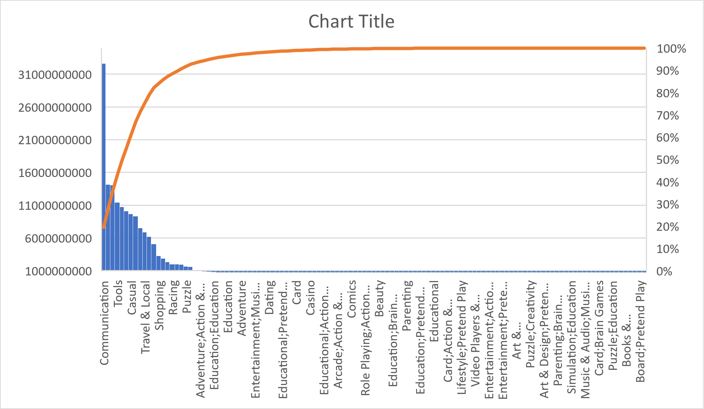
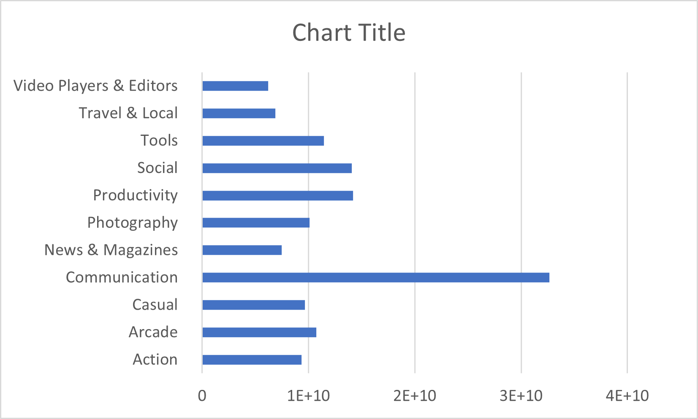

# map-reduce-amulya
This is to practice map and reduce

## Question to be answered
Google play store apps individual downloads based on genres 

## Context
While many public datasets provide Apple App Store data, there are not many counterpart datasets available for Google Play Store apps anywhere on the web. On digging deeper, I found out that iTunes App Store page deploys a nicely indexed appendix-like structure to allow for simple and easy web scraping. On the other hand, Google Play Store uses sophisticated modern-day techniques (like dynamic page load) using JQuery making scraping more challenging.

## Data
For this map reduce, I have used google play store App data. Each app (row) has values for catergory, rating, size, installs, reviews and more. This data is taken from the website kaggle. The data set I have taken consists of 18 different data columns. The dataset consists of 10841 records.

## Summary of the result

From the below graph we can analyze that communication genre has high downloads followed by tools.

